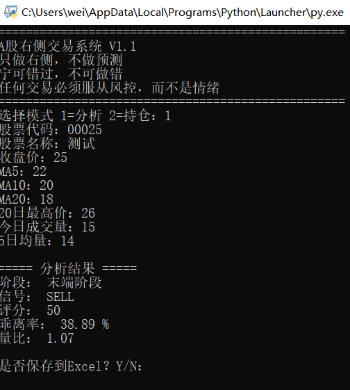

# A股右侧交易系统 V1.1

> 只做右侧，不做预测
> 宁可错过，不可做错
> 任何交易必须服从风控，而不是情绪

---

## 一、阶段识别（右侧趋势判断）

| 阶段 | 条件 | 信号 |
|------|------|------|
| **起涨阶段** | MA5 > MA10 > MA20 且 收盘价 > MA20 且 乖离率 ≤ 8% | BUY（买入） |
| **加速阶段** | MA5 > MA10 > MA20 且 乖离率 ≤ 18% | HOLD（持有） |
| **末端阶段** | 乖离率 > 18% | SELL（卖出） |
| **震荡整理** | 不满足以上条件 | WATCH（观望） |

### 乖离率计算
```
乖离率 = (收盘价 - MA20) / MA20 × 100%
```

---

## 二、持仓风控规则

### 止损规则

| 条件 | 动作 | 风险等级 |
|------|------|----------|
| 亏损 ≥ 8% | 强制止损（不允许扛单） | 高风险 |
| 跌破 MA20 | 清仓信号 | 高风险 |
| 跌破 MA10 | 建议减仓50% | 中风险 |

### 止盈规则

| 条件 | 动作 |
|------|------|
| 盈利 ≥ 10% | 可分批止盈 |
| 盈利 ≥ 20% | 高位风险区 |

---

## 三、评分系统（0-100分）

| 条件 | 得分 |
|------|------|
| MA5 > MA10 > MA20（多头排列） | +30 |
| 收盘价 > MA20 | +20 |
| 0% < 乖离率 < 10% | +20 |
| 1 ≤ 量比 ≤ 2 | +20 |
| 乖离率 > 18% | -20 |

**评分范围**：0 - 100分

---

## 四、颜色标记

| 阶段 | 颜色 | 说明 |
|------|------|------|
| 起涨阶段 | 绿色 | 买入信号 |
| 加速阶段 | 黄色 | 持有信号 |
| 末端阶段 | 红色 | 卖出信号 |
| 震荡整理 | 灰色 | 观望信号 |

---

## 五、使用说明

### 输入参数

1. 股票代码、名称
2. 收盘价
3. MA5、MA10、MA20
4. 20日最高价
5. 今日成交量、5日均量

### 输出结果

- 阶段判断 + 交易信号
- 评分
- 乖离率、量比
- 持仓模式：收益率 + 风险等级 + 风控建议

### 数据保存

- Excel文件：`AI_Trade_Record.xlsx`
- 包含历史交易记录和统计分析
  